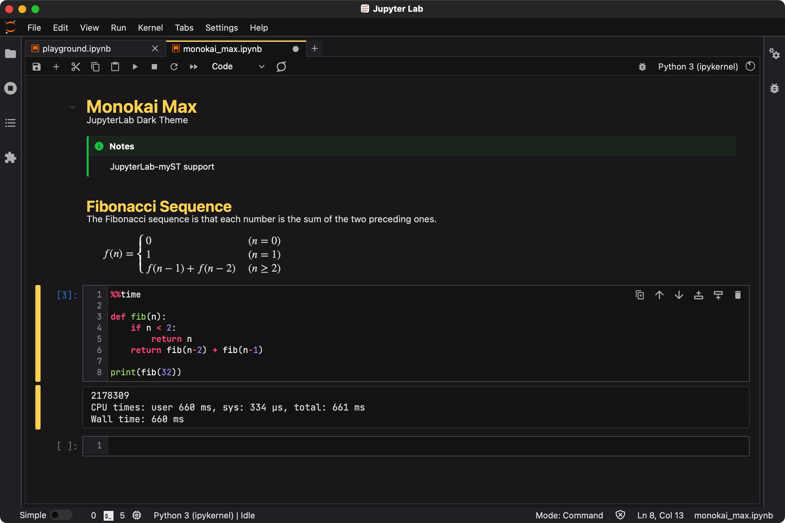

# monokai_max

A JupyterLab theme.



## Requirements

- JupyterLab >= 3.0

## Install

To install the extension, execute:

```bash
pip install dist/monokai_max-0.1.0-py3-none-any.whl
```

## Uninstall

To remove the extension, execute:

```bash
pip uninstall monokai_max
```

## Contributing

### Development install

Note: You will need NodeJS to build the extension package.

```bash
pip install -e .
jupyter labextension develop . --overwrite
jlpm build
jlpm watch
```
